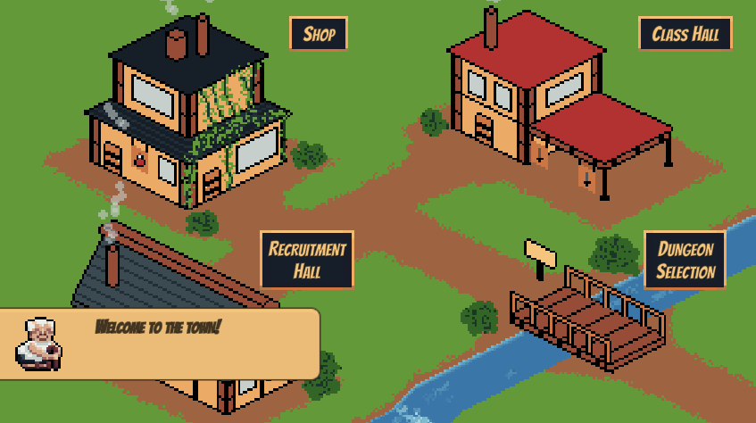
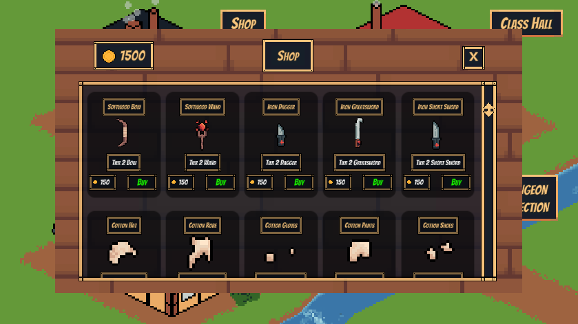
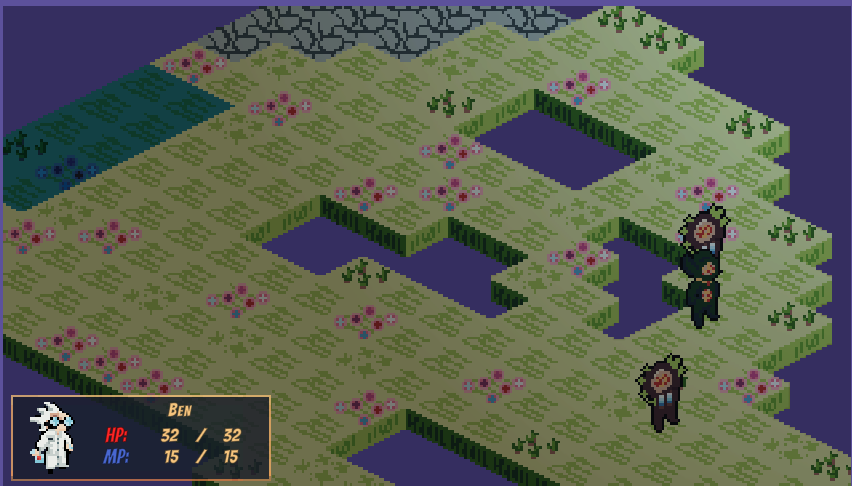

# Dungeons-of-Akazarn
Dungeons of Akazarn is a 2D RPG game developed using Unity as a senior capstone project over the course of a semester. This project was a collaborative effort by a team of four developers, overseen by a professor, to create an engaging game featuring custom pixel art assets. The game is available to play on itch.io.
https://www.youtube.com/watch?v=aVqbQxU6E_Q

## Goal
The goal of this project was to design and develop a fully functional 2D RPG with a focus on custom pixel art assets, diverse gameplay mechanics, a cohesive team development process, and a focus on using proper coding practices. The project aimed to showcase our ability to collaborate on a large codebase, integrate art and programming, and deliver a polished game within a semester. 

## Contributions
As part of a four-person team, I contributed to a large C# codebase in Unity, with responsibilities including:
- Designing and implementing front-end user interfaces and menus.
- Creating interactive gameplay elements and mini-games.
- Developing custom pixel art assets and animations to bring the game world to life.
- Collaborating closely with teammates to ensure seamless integration of art and code.

## Skills Learned
### Team Collaboration: 
Worked effectively in a team of four, using version control and meetings to manage tasks and deadlines.
### C# Programming: 
Gained proficiency in writing and debugging C# scripts for gameplay mechanics, UI, and interactions in Unity.
### Pixel Art and Animation: 
Developed skills in creating and animating custom pixel art assets tailored to the game's aesthetic.
### UI/UX Design: 
Designed intuitive user interfaces and menus to enhance player experience.
### Project Management: 
Learned to prioritize tasks, communicate effectively, and deliver a polished product under the guidance of a professor.

## Tools Used
- Unity
- C#
- Plastic SCM
- Aseprite
- Visual Studio

## Acknowledgments
Special thanks to my three teammates and our professor for their guidance and support throughout the project. This capstone experience was a valuable opportunity to apply programming, art, and teamwork skills in a real-world game development context.

## Screenshots

